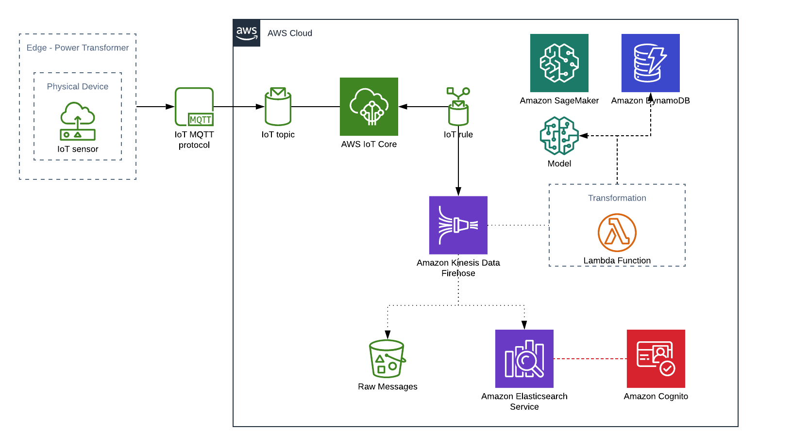
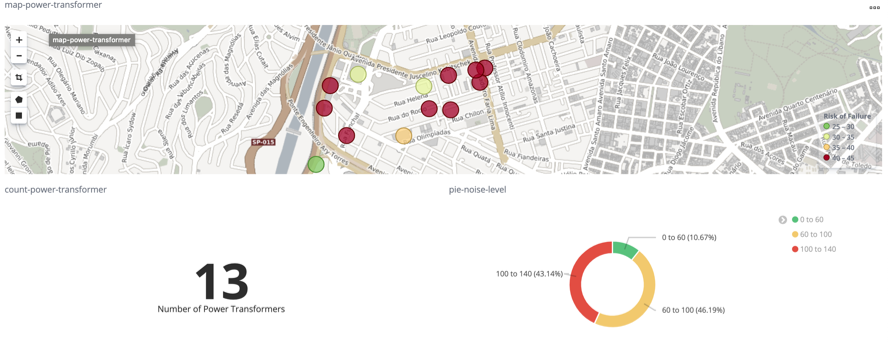
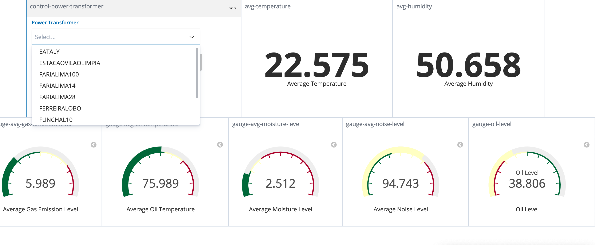

## Power Transformers Analytics with IoT Core, Kinesis, and Elasticsearch

## Overview

The goal of this project is to deploy, using AWS CDK, a sample stack to analyze sensor data from *Distribution Power Transformers*. The best way to simulate these *power transformers* is to use [IoT Device Simulator](https://aws.amazon.com/solutions/implementations/iot-device-simulator/).

But you can use any code that can send messages to a Topic on AWS, including the IoT Getting Started, to simulate your devices. Include a sample client provided.

## Execute

There is a script called `run.sh` that already executes the steps required to deploy this CDK, and you can run it with `chmod +x run.sh; USER_EMAIL=user@domain.com ./run.sh`

## Kibana Dashboards

Once you're sending data, you can check the dashboards bellow in Kibana:

### Overview Dashboard

### Details Dashboard

## Security

See [CONTRIBUTING](CONTRIBUTING.md#security-issue-notifications) for more information.

## License

This library is licensed under the MIT-0 License. See the LICENSE file.

